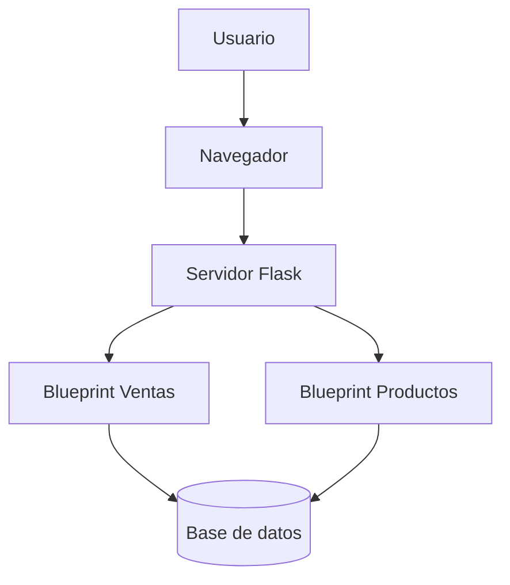
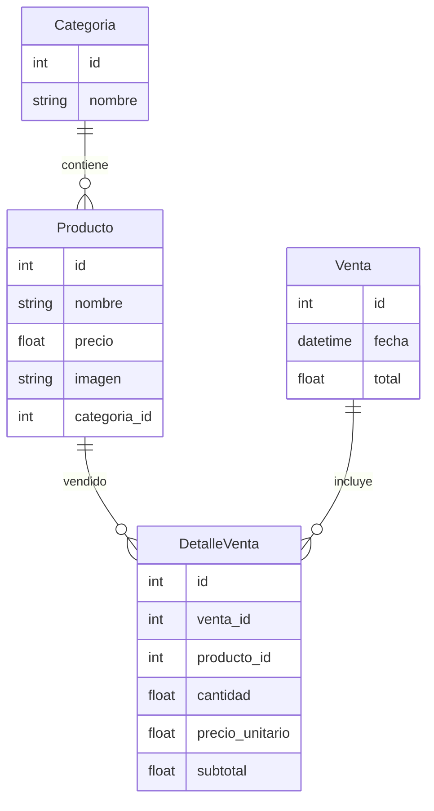
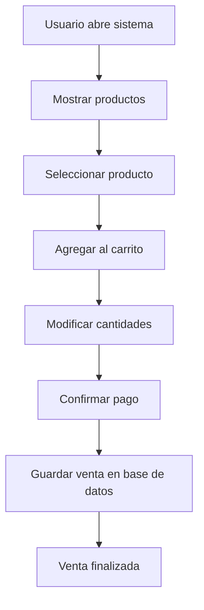
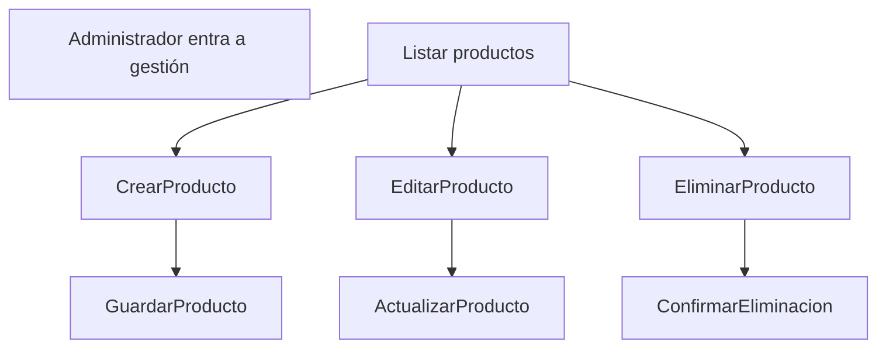

# SmartFrut

Sistema web para gestión de ventas y productos orientado a fruterías, minimarkets o pequeños comercios. El sistema permite administrar productos, categorías y registrar ventas mediante un flujo tipo punto de venta (POS).

---

# Características

* Gestión de productos
* Gestión de categorías
* Punto de venta con carrito
* Registro de ventas
* Subida de imágenes de productos
* Filtrado de productos por categoría
* Interfaz web sencilla

---

# Tecnologías utilizadas

* Python
* Flask
* SQLAlchemy
* SQLite (por defecto)
* HTML / Jinja2
* JavaScript

---

# Arquitectura del sistema

SmartFrut utiliza una arquitectura basada en Flask con Blueprints para separar funcionalidades.



---

# Estructura general del proyecto

```
SmartFrut
│
├── app
│   ├── routes
│   │   ├── main.py
│   │   └── products.py
│   │
│   ├── models.py
│   ├── __init__.py
│   └── database
│
├── static
├── templates
├── config.py
└── run.py
```

---

# Modelos de base de datos

El sistema utiliza cuatro entidades principales.



---

# Funcionamiento del sistema

El sistema se divide en dos áreas principales:

1. Punto de venta
2. Gestión de productos

---

# Flujo del punto de venta



---

# Flujo de gestión de productos



---

# Endpoints principales

## Ventas

| Ruta                | Método | Descripción                     |
| ------------------- | ------ | ------------------------------- |
| /                   | GET    | Página principal del POS        |
| /filtrar_productos  | GET    | Filtrar productos por categoría |
| /agregar_al_carrito | POST   | Añadir producto al carrito      |
| /actualizar_carrito | POST   | Modificar cantidades            |
| /pagar              | POST   | Registrar la venta              |

## Productos

| Ruta                     | Método   | Descripción       |
| ------------------------ | -------- | ----------------- |
| /productos/              | GET      | Listar productos  |
| /productos/nuevo         | GET/POST | Crear producto    |
| /productos/editar/<id>   | GET/POST | Editar producto   |
| /productos/eliminar/<id> | POST     | Eliminar producto |

---

# Instalación

## 1 Clonar repositorio

```
git clone https://github.com/simsimi2143/SmartFrut.git
cd SmartFrut
```

## 2 Crear entorno virtual

```
python -m venv venv
```

Activar entorno:

Windows

```
venv\\Scripts\\activate
```

Linux / Mac

```
source venv/bin/activate
```

## 3 Instalar dependencias

```
pip install -r requirements.txt
```

## 4 Ejecutar aplicación

```
python run.py
```

Abrir navegador en

```
http://localhost:5000
```

---

# Uso del sistema

## Registrar una venta

1. Abrir el sistema
2. Seleccionar productos
3. Ajustar cantidades
4. Presionar pagar
5. El sistema registrará la venta

## Administrar productos

1. Ir a gestión de productos
2. Crear, editar o eliminar productos
3. Asignar categorías
4. Subir imagen del producto

---

# Posibles mejoras futuras

* Sistema de usuarios
* Control de inventario
* Reportes de ventas
* Exportación a Excel
* Facturación
* Integración con impresoras térmicas

---

# Autor

Yoshua Simsimi|InfiwebSpA

Proyecto desarrollado como sistema de gestión de ventas para pequeños comercios.
